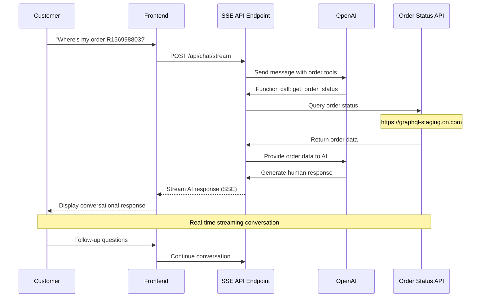

# Conversational Commerce AI Assistant

An AI-powered order status assistant built with Next.js. Customers can ask "Where's my order?" and get real-time order status information through a conversational interface powered by OpenAI and Server-Sent Events.

## What This App Does

This application provides an intelligent customer service assistant that:

- **Understands Natural Language**: Customers can ask about their orders in plain English
- **Fetches Real Order Data**: Integrates with GraphQL APIs to retrieve actual order status, tracking numbers, and delivery estimates  
- **Streams Responses**: Uses Server-Sent Events (SSE) for real-time conversational experience
- **Provides Rich Information**: Displays order status, tracking links, estimated delivery dates, and more

## Application Flow



## Getting Started

### Prerequisites

- [Node.js](https://nodejs.org/) (v22 or newer)
- [PNPM](https://pnpm.io/) (v10 or newer)
- OpenAI API Key

### Setup

1. Install dependencies:
```bash
pnpm install
```

2. Copy environment variables:
```bash
cp .env.example .env.local
```

3. Add your OpenAI API key to `.env.local`:
```
OPENAI_API_KEY=your_openai_api_key_here
```

### Development

Start the development server with Turbopack:

```bash
pnpm dev
```

The chat interface will be available at [http://localhost:3000](http://localhost:3000).

## API Endpoints

### 1. Chat Interface (AI SDK Streaming)
- **URL**: `/api/chat/stream`  
- **Method**: POST
- **Usage**: Used by the React chat interface with AI SDK hooks
- **Format**: AI SDK data stream protocol

### 2. Server-Sent Events (SSE)
- **URL**: `/api/sse`
- **Method**: POST  
- **Content-Type**: `text/event-stream`
- **Usage**: Traditional SSE endpoint for external integrations
- **Demo**: Available at [http://localhost:3000/sse-demo](http://localhost:3000/sse-demo)

**SSE Event Types:**
- `connected` - Initial connection established
- `typing` - AI is processing the request  
- `chunk` - Streaming text content
- `completed` - Response finished with summary
- `error` - Error occurred during processing
- `[DONE]` - Final termination signal

**Example SSE Request:**
```bash
curl -X POST http://localhost:3000/api/sse \
  -H "Content-Type: application/json" \
  -d '{"message": "Where is my order R156998803 for mobile.developer+22@on-running.com?"}'
```

### Build for Production

```bash
pnpm build
```

