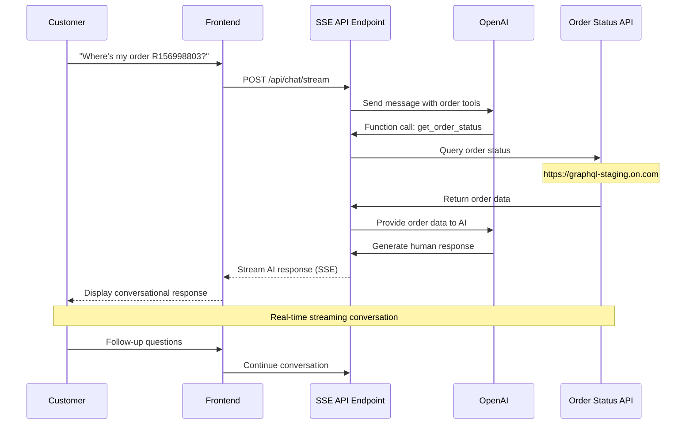

# Conversational Commerce AI Assistant

An AI-powered order status assistant built with Next.js. Customers can ask "Where's my order?" and get real-time order status information through a conversational interface powered by OpenAI and Server-Sent Events.

## What This App Does

This application provides an intelligent customer service assistant that:

- **Understands Natural Language**: Customers can ask about their orders in plain English
- **Fetches Real Order Data**: Integrates with GraphQL APIs to retrieve actual order status, tracking numbers, and delivery estimates  
- **Streams Responses**: Uses Server-Sent Events (SSE) for real-time conversational experience
- **Provides Rich Information**: Displays order status, tracking links, estimated delivery dates, and more

## Application Flow



## Features

- **[Next.js 15](https://nextjs.org/)** - The React framework for production
- **[React 19](https://react.dev/)** - The library for web and native user interfaces
- **[TypeScript](https://www.typescriptlang.org/)** - JavaScript with syntax for types
- **[TailwindCSS 4](https://tailwindcss.com/)** - A utility-first CSS framework
- **[shadcn/ui](https://ui.shadcn.com/)** - Beautifully designed components built with Radix UI and Tailwind CSS
- **[next-themes](https://github.com/pacocoursey/next-themes)** - Perfect dark mode for Next.js
- **[Biome](https://biomejs.dev/)** - Fast linter and formatter for JavaScript, TypeScript, JSX, and more
- **[Lefthook](https://github.com/evilmartians/lefthook)** - Git hooks manager
- **[PNPM](https://pnpm.io/)** - Fast, disk space efficient package manager
- **[Turbopack](https://turbo.build/pack)** - Incremental bundler for development
- **[Geist Fonts](https://vercel.com/font/geist)** - Beautiful, modern typeface by Vercel
- **[Vitest](https://vitest.dev/)** - Fast unit/integration testing framework
- **[@testing-library/react](https://testing-library.com/docs/react-testing-library/intro/)** - Simple and complete React DOM testing utilities

## Getting Started

### Prerequisites

- [Node.js](https://nodejs.org/) (v22 or newer)
- [PNPM](https://pnpm.io/) (v10 or newer)

### Development

Start the development server with Turbopack:

```bash
pnpm dev
```

Your application will be available at [http://localhost:3000](http://localhost:3000).

### Build for Production

```bash
pnpm build
```

### Start Production Server

```bash
pnpm start
```

### Linting

```bash
# Check for linting issues
pnpm lint

# Fix linting issues
pnpm lint:fix
```

### Testing

Run tests with Vitest and @testing-library/react:

```bash
pnpm test
```

For the interactive UI:

```bash
pnpm test:ui
```

To check coverage:

```bash
pnpm test:coverage
```

Test files are located in the `test/` directory. See `test/home.test.tsx` for an example.

## Project Structure

```shell
nextjs_boilerplate/
├── public/                # Static assets
├── src/
│   ├── app/               # App router pages and layouts
│   │   ├── globals.css    # Global styles
│   │   ├── layout.tsx     # Root layout
│   │   ├── page.tsx       # Home page
│   │   └── favicon.ico    # Favicon
│   ├── components/        # React components
│   │   ├── ui/            # shadcn/ui components
│   │   ├── theme-provider.tsx # Theme provider wrapper
│   │   └── theme-switcher.tsx # Dark/light mode toggle
│   └── lib/               # Utility functions
│       └── utils.ts       # Class name utility
├── test/                  # Vitest and Testing Library tests
│   ├── home.test.tsx      # Example test for Home page
│   └── setup.ts           # Test setup file
├── .gitignore             # Git ignore file
├── biome.json             # Biome configuration
├── components.json        # UI components configuration
├── lefthook.yml           # Git hooks configuration
├── next.config.ts         # Next.js configuration
├── next-env.d.ts          # Next.js type definitions
├── package.json           # Project dependencies and scripts
├── pnpm-lock.yaml         # Lockfile for pnpm
├── pnpm-workspace.yaml    # pnpm workspace configuration
├── postcss.config.mjs     # PostCSS configuration
├── README.md              # Project documentation
├── tsconfig.json          # TypeScript configuration
├── vitest.config.ts       # Vitest configuration
└── .nvmrc                 # Node version
```

## Git Hooks

This boilerplate uses Lefthook to manage Git hooks:

- **pre-commit**: Automatically formats and lints staged files using Biome
- **pre-push**: Checks files for linting issues before pushing

## Customization

### TailwindCSS

The project uses TailwindCSS 4 with a custom configuration. You can modify the theme in `src/app/globals.css`.

### Biome

Biome is configured in `biome.json`. You can adjust linting and formatting rules to match your preferences.

### Next.js

Customize your Next.js configuration in `next.config.ts`.

## Contributing

1. Fork the repository
2. Create your feature branch (`git checkout -b feature/amazing-feature`)
3. Commit your changes (`git commit -m 'Add some amazing feature'`)
4. Push to the branch (`git push origin feature/amazing-feature`)
5. Open a Pull Request

## License

This project is licensed under the MIT License - see the LICENSE file for details.

## Acknowledgments

- [Next.js](https://nextjs.org/)
- [TailwindCSS](https://tailwindcss.com/)
- [shadcn/ui](https://ui.shadcn.com/)
- [Biome](https://biomejs.dev/)
- [Lefthook](https://github.com/evilmartians/lefthook)
- [Vitest](https://vitest.dev/)
- [@testing-library/react](https://testing-library.com/docs/react-testing-library/intro/)
